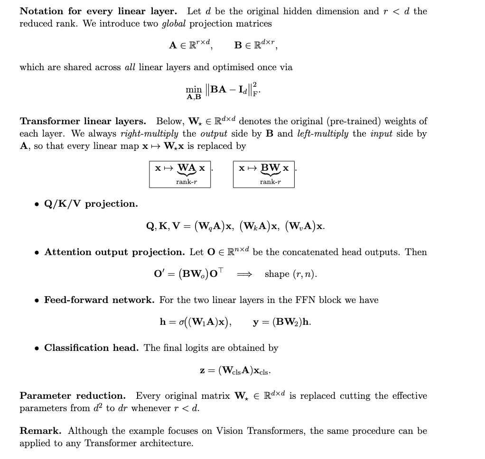

# vit-thinner
ViT Hidden-Dimension Reduction (Training-Free)
# ViT Hidden-Dimension Reduction (Training-Free)

A trial to reduce the hidden dimension of ViT-based models.

## Methods

## Results

| Rank $r$ | Compression Ratio | Top-1 Acc (↑) | Top-5 Acc (↑) |
| -------- | ----------------- | ------------- | ------------- |
| 832      | 0 %               | **87.91 %**   | **98.50 %**   |
| 800      | 3.9 %             | 85.49 %       | 97.76 %       |
| 780      | 5.2 %             | 81.57 %       | 96.12 %       |
| 760      | 7.6 %             | 77.25 %       | 94.21 %       |

Compression ratio is relative to the original hidden dimension d. The model (vit_so150m2_patch16_reg1_gap_384.sbb_e200_in12k_ft_in1k) I've tested on is 832.

